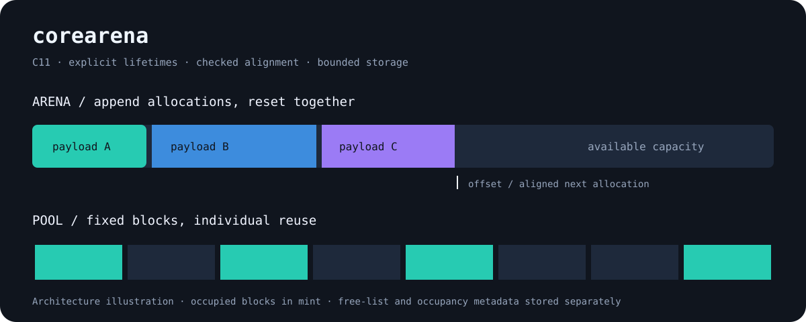

# corearena

Small C11 arena and fixed block pool allocators with explicit lifetime rules, alignment checks, overflow protection and allocation statistics. Designed for transient frame data and bounded object sets.



## Build and run

```sh
cmake -S . -B build -DCMAKE_BUILD_TYPE=Debug -DCOREARENA_SANITIZE=ON
cmake --build build
ctest --test-dir build --output-on-failure
./build/frame_example
```

For timings use a separate Release build with sanitizers disabled and run `corearena_bench`. The benchmark reports local CPU time for one million small allocations per allocator; these numbers are workload specific.

```c
#include "corearena.h"
#include <stdalign.h>
ca_arena arena;
if (ca_arena_init(&arena, 4096)) {
    int *items = ca_arena_calloc(&arena, 32, sizeof(int), alignof(int));
    if (items) items[0] = 42;
    ca_arena_reset(&arena);
    ca_arena_destroy(&arena);
}
```

## Design

The arena advances a byte offset in one owned allocation. Alignment padding counts toward used bytes. Marks record the arena, generation, offset and number of live allocations. A successful rewind expires all existing marks and reclaims later allocations. The pool stores a free list and occupancy map separately from payload blocks; free rejects foreign pointers, interior pointers and double frees.

Both allocators have O(1) allocation. Arena reset is O(1); pool reset is O(capacity). Pool setup makes three allocations and stores one `size_t` plus one byte of metadata per block. Neither allocator is thread safe; synchronize access or use one instance per thread.

## Lifetime contract

Pointers become invalid on reset, rewind of their region, or destroy. Memory remains physically allocated after a reset, so AddressSanitizer cannot detect every logical use after reset. A stale pool pointer whose address has been reallocated cannot be distinguished from the current owner. Marks are valid only within one initialization; never edit mark fields or reuse marks across destruction. Do not initialize an already initialized object without destroying it.

The API returns `NULL` or `false` on invalid input and exhaustion. No implicit growth, fallback allocator or individual arena free is provided. See [API reference](docs/API.md), [lifetime example](examples/frame.c) and [verification record](docs/VERIFICATION.md).

MIT © 2026 Borep1945.
